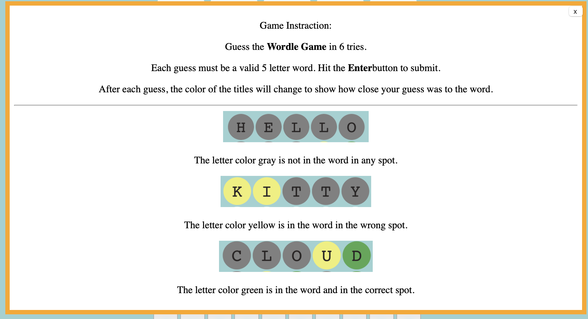

# wordle-app

## first my project1

This is my first project to create "Wordle Game"
Wardle itself is such a simple game. However,This is the first project out 4 of for General Assembly Software Engineering Intensive Course. 
Please try to play [Play from here "Wordle link"](https://MKuma5555.github.io/wordle-app/wordle.html)

# What are the my Wordle rules?

* To submit a guess, type any five-letter word and press enter.
* You have to guess the Wordle "Word" in six times or less
* All of your guesses must be real words & must be in the word list. (There are  12,971 words in this list.)
* A correct letter in right position **turns green**
* A correct letter in the wrong position **turns yellow**
* An incorrect letter **turns gray**
* Letters can be used more than once
* Answers are never plurals
* You must be type five-letter
* Six-times missed, It's Game over
* You can try again as much as you want to restart 

# My Steps
1. create boxes use HTML & CSS first(able to see visually first)
2. box set in right position
3. JS: keyboard button click and letter get into the box (first-Row/first-column)
4. create new js just add word list array.
5. set "Enter key" & "Back space key"
6. check the guess word is matching with random word.
7. changing box letter color (use add classList)
8. add color chang for keyboard
9. create replay rule(delete pre data )
10. checking the guess word is in the word list.
11. arranging CSS

  
